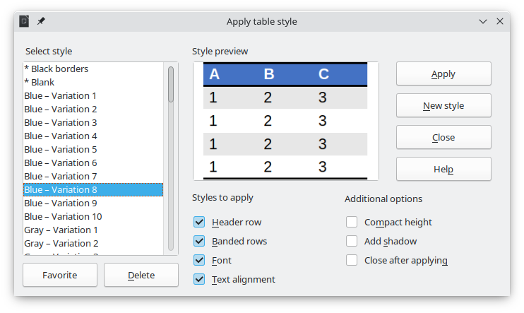
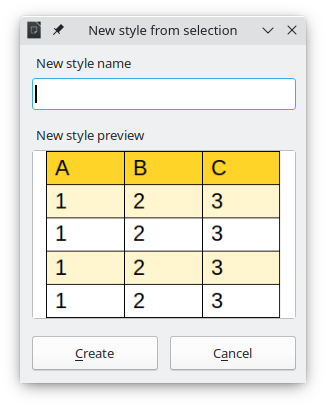

# Impress Table Formatter

Quickly format and create styles for LibreOffice Impress/Draw tables.

New styles can be created from the selected table:

**This extension is still in alpha stage and it is not recommended to use it for production.**

## Compatibility

This extension will only work in LibreOffice 7.4 or newer.

This extension does not run in OpenOffice.

## Installation

Download the latest OXT file and install it using the Extension Manager.

## Basic usage

After installing the extension, it can be started in 3 main ways:
- Using the *Alt + Shift + T* shortcut
- Using the menubar: Format - Impress Table Formatter
- Usint the new icon in the Table toolbar

### Applying styles to tables

- Select a table in Impress/Draw
- Open the extension dialog using one of the methods described above
- Select one of the available styles
- Select which items of the style to apply
- Click *Apply*

### Creating new styles

This extension can create a new style from a selected table:

- Create a table with at least 3 columns and 5 rows
- Format the table (the extension supports header rows, banded rows and normal rows)
- Select the table and open the extension dialog
- Click *New style*
- A window will appear with a preview of the new style
- Provide a name for the new style and click *Create*
